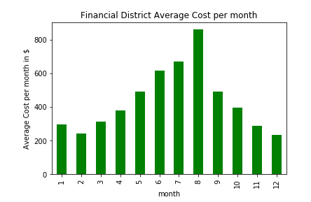
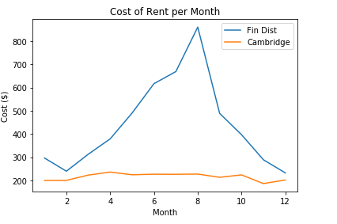
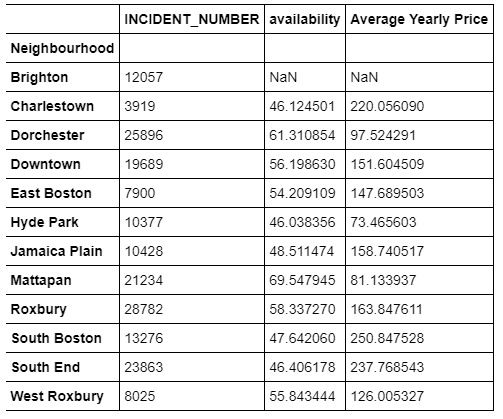

<b>I</b>n the blog post, I will examine how Boston’s neighbourhoods are affected by seasonal price fluctuations and also have a look into 
whether or not crime may have anything to do with differences in price and availability of AirBnB rentals.

The data used for this blog comes from AirBnb Boston and the Boston Police department for Crimes around the city. These crimes include 
every arrest made and are logged down under categories; such as homicide or assault.

<h3>Why Boston?</h3> 

Known for its rich history dating back to the 1600’s, Boston is a cultural hub that attracts many visitors from all over the world. 
Hence, I was curious to see how AirBnb fairs in the big city with customers and reviews.

<i>
I have broken this down into 3 questions:
<ol>
<li>What are the most popular areas amongst customers? </li>
<li>How does pricing fluctuations trend between seasonal periods?</li>
<li>Does Crime have an impact of pricing and rental ability?</li>
</ol>
</i>

<h3>Question 1: Popular Areas </h3>

AirBnb has several review categories that a customer can rate the accommodation based on:
<ul>
<li>Accuracy of the Ad</li>
<li>Cleanliness of the room</li>
<li>Check in — was it easy?</li>
<li>Communication with the owner</li>
<li>Value</li>
<li>Location</li>
  </ul>
Combining all these scores gives a total review score out of 10. Scores have been grouped and calculated as a mean of the Neighbourhood.
We can see most neighbourhoods score very highly in Boston:

This graph shows us that a few of the areas a slight standouts for reviews, with neighbourhoods such as Financial District scoring a 
perfect 10/10 for all factors. It can also be seen that Cambridge scored a relatively low score in comparison to the average 
neighbourhood.

Based on this data, and the breakdown of the reviews, we can see that most areas in Boston are generally pretty well perceived by 
AirBnB guests. So can we break this down further to look into the pricing fluctuations between neighbourhoods and seasons?

<h3>Question 2: Neighbourhood Price Fluctuations </h3>

I expected to see obvious spikes in the cost of rent as the summer months approached in Boston, however I saw a few surprises when 
breaking the data down. Firstly, a glimpse into average cost of rent per month of all neighbourhoods looks a little like the 
below diagram.

Above we can see that the price of rent begins to slowly rise as the year progresses, with the highest mean cost of rent being in Autumn.
If we have a look at our 2 standouts mentioned above (Cambridge & Financial District) can we notice a similar pattern in the fluctuations.

<h3>Cambridge</h3>

Firstly looking at our worst reviewed Neighbourhood, Cambridge, I expected to see a lower cost of rental and less than normal fluctuation in price. Cambridge saw a total of 730 reviews, meaning they have had a fair few rentals in the year. This was the average price fluctuation the neighbourhood saw.

We can see a lack of any obvious trend in the graph, meaning the neighbourhood doesn’t seem to have any ‘hot’ months for tourists.

<h3>Financial District</h3>

In comparison, the Financial District with all rooms scoring a perfect score from over 1400 reviews, is a much more in demand area to stay. I was expecting to see some clear cut trends on pricing and demand.

Not only is there an obvious trend toward higher prices in summer, meaning more demand for rental, but we can see the price significantly increases to the average Boston rental cost of ~$200 a night. To put this into perspective, here the two Neighbourhoods are when mapped next to each other:

<h3> Question 3: Crime impact on Price & Rental </h3>

Looking at our final data breakdown of the data from Boston’s AirBnb rental, I wanted to understand the trends between crime and rental price/availability. The above heatmap shows a random sample of over 1000 crimes in the City, which seems to show a high density of activity coming from the Southern Neighbourhoods in Boston. To be confident the random sample is somewhat correct in showing trends, we can look at the total incident counts per neighbourhood:

I have highlighted our highest counts for crimes in certain neighbourhoods, which means we can assume these areas are the most violent. All 3 neighbourhoods are actually next to each other in the Southern region of the city. For the sake of it, lets first look at our highest and lowest incident count, and compare price/availability of AirBnb rentals.

Charlestown being the lowest with only 4155 incident counts over the year in comparison to Roxbury with 31,230, has almost 8x less the amount of crime in the area.

Here we can see that Charlestown has a higher price over the year, with Roxbury only coming close during the Summer months. Roxbury also had a significantly higher availability rate of rentals at 58% available, compared to Charlestown at 53%. We can therefore assume that Charlestown is a slightly more in demand area in comparison, however before assuming this has anything to do with crime we can do a deeper dive into the breakdown of cost, availability and crimes amongst all areas first.

<h3>Graphing our Totals (Price, Availability & Incidents)</h3>
  
  

A higher availability means that the properties in the neighbourhood are easier to rent and more available to people. Lower availability means that properties are more in demand and sell out quicker.

Having a look at all the neighbourhoods, the trends seem to be that the lower crime neighbourhoods are more expensive and are more difficult to rent in comparison to areas such as Dorchester, where incident counts and availability are high, but the price is low.

If you would like to have a look into my breakdown of the data, the link to my Github repository is <a href = "https://github.com/qasim1020/Writing-a-Data-Scientist-blog--Post/tree/Test">here</a>

Thanks for taking the time to read this blog, I appreciate all feedback and critiques.
